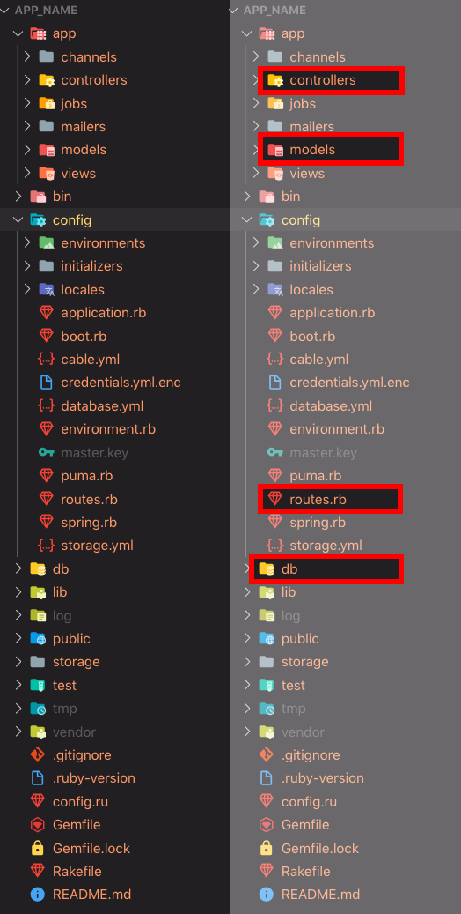
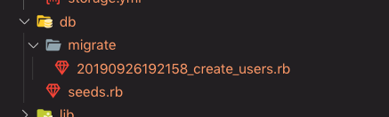
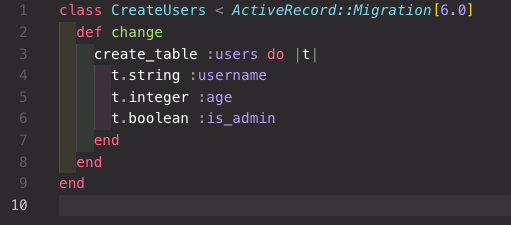
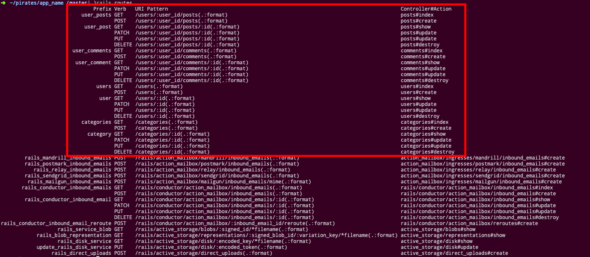

# Rails from Scratch 101

We're going to take a high level overview of Rails and the way it works. This is intended to see how the files connect, and not necessarily intended to be a complete guide to making a Rails app.

## Before You Begin
If you haven't already, make sure to install the Rails and Postgres gems. Navigate through the terminal to the folder you want to work in and enter the following commands:

`gem install rails`

`gem install pg`

If you have any errors while installing these gems, Google the error messages and see if you can work through them. If you can't work through the errors, reach out to an instructor for help.

## Getting Started
Once we've got the Rails and Postgres gems installed, we're ready to create our app by entering the following command:

`rails new app_name --api --database=postgresql`

This will build out a complete file/folder structure for a blank Rails server. Once the app has been created, we need to `cd` into it. Once inside the folder, we can run `rails db:create` to create the database for our application. It will automatically be named after our app's name. These can be found in Postico or psql as `app_name_test` and `app_name_development`, but we only need to focus on the `development` one.

# You Do

Take a moment to create a Rails app by following the above instructions, so we can look at and discuss the file structure as a group.

## The Directory Structure

Let's take a look at the directory contents—there's a lot here but luckily, most of these files don't need to be touched at all. We will primarily be working in four spots in this file structure:

<!--
-->
The directory names highlighted in the image above should conceptually look familiar. We will go over these four directories more in depth over the next week but for now, let's take a brief overview of them. In Rails, our controllers and routes are defined separately, and our models and database are defined separately. 

> So how is the functionality split up with these files?
 
1. Our routes are defined in a single file that is located inside of the `/config/` directory. Here, we can tell our Rails server to look for any HTTP method on a route (url path) we define ourselves. We also provide a controller and method for each path.

2. Our controllers are found inside of the `/app/` directory. Typically, we will have a controller for each of our models. We *do* have to freedom to make these however we want though.

3. Also in our `/app/` directory, we can find our models. This is where we define rules for how we interact with our database. This is **NOT** where we define what our tables look like. For example, we may want to define that a user's email is formatted correctly or their username is unique. We also define our associations here in this directory.

4. Finally, our `/db/` directory is where we define our tables and columns. We will be using a new technique for doing so, called a **migration**. We will create migration files that Rails will use as a blueprint to create our database. These migration files come with some specific rules to follow, but also solve a major problem for production databases that we have not yet covered in the course.

## Databases and Migrations

In Rails, we use migration files to track the evolution of our database over time. Previously, when we used Sequelize with Express, we had to reset our database **every** time we made a change to a table. This works well enough for us in development, but does not work well for production databases. Facebook does not drop all of their users each time they want to implement a new feature. 

This is where migration files come in handy. A migration will define a specific change to the database, and are kept in a given (ideally chronological) order. By using migrations, Rails can keep track of how the database has been changed and what changes still need to happen without having to reset your entire database. 

> So how do we make a migration file?

Rails has a CLI tool for adding files that we need for our app. We can call it with `rails generator` (or `rails g` for short) followed by the type of file that we need. In this case, we can use:

```shell
rails generate migration CreateUsers username age:integer is_admin:boolean
```

`CreateUsers` is the name of our migration and `username age:integer is_admin:boolean` are our options for the migration file. We have omitted the `:string` for username, since string is the default type for a column.

This will make a new file in `/db/migrate`:

<!--
-->
Our new file looks like this:

<!--
-->
We can see that the command automatically filled in the migration with items that resemble what we put into our command line. Once we `CreateUsers`, it is defined as a class with the same name. We also have a `change` method defined here that runs `create_table`. Inside of the do/end block, we see lines that resemble our columns. This migration is now ready to go, and we can use it to modify our database.

> But how did Rails know how make our migration file?

`rails g migration` has specific syntax that it looks for. A great resource for these keywords can be found in the rails docs here: [Rails Migrations](https://guides.rubyonrails.org/active_record_migrations.html) There are keywords for almost everything that you would ever want to do. Create table, drop table, add column, add foreign reference keys, change column name or data type. They're all available to you.

> But what if I want to do something different? 
> 
> \*\*or rather I can't find the syntax for what I want.\*\*

We can always make a blank migration and call it whatever we want. If we ever add a name that Rails can't parse into keywords, it will still make a migration for us with a class and a `change` method. Upon creating the migration, we're able to add whatever changes we want.

Once we are happy with the way our migration files look, we are ready to run them. However, be aware that once we have run these files, we are committed to them. We cannot edit these files after they have been migrated to our database. This is very important. We cannot edit past migrations! **We cannot edit past migrations!** **WE CANNOT EDIT PAST MIGRATIONS!** Once we have migrated these files, the only way to make changes to our database will be through new migrations. Rails needs the old migration files intact to keep track of how our database is shaped at any given point.

> So how do we run these migration files?

Rails has built-in scripts that we can run. We have already used one to create our database: `rails db:create`. To run our migration files, we run something similar:

```shell
rails db:migrate
```

This will run all of our migration files that haven't been previously run. Since this is our first migration, we will see a new file in our `/db/` directory.

<!--
-->
The schema file represents what our database looks like currently. We can always refer back here to see how our tables are currently set up.

# You Do

At this point we should have a "users" table. On your own, try to make two new migrations.

1. Make a migration that creates a "posts" table. The table should have a `content` column that is a `string`, as well as a reference key to the "users" table. You can do this by adding `user:references` to the CLI command (`rails g migration etc.`.
2. Make a migration that creates a "comments" table. This table should also have `content` with a type of `string`, and should reference both the "users" table and the "posts" table.
3. Once you're happy with the way that they look, migrate your files.

Once you've completed this exercise, let's talk about how this went. Were there any issues that you ran into? Did the commands work the way that you expected them to?

## Models

We need to create a model for any table that we want to access in our controllers. We can also use a rails generator to create our models for us as well. One syntax difference here though is that our models are going to be singular as opposed to plural like in the migrations: `rails g User`. By default, Rails will also generate a migration along with our models. We can simply pass the same options for our table columns after the model name. (yes, we could have done this instead of making our previous migrations. Typically that's how it's done but some extra practice doesn't hurt).

```shell
rails g User --skip-migration
rails g Post --skip-migration
rails g Comment --skip-migration

```

Normally we can skip the `--skip-migration` flag on this command.

Let's make a categories model for our app but include options for a migration file as well.

```shell
rails g Category topic post:references

```

Now we can check out files and see that a model was created as well as a migration file. Since we have a new migration so let's migrate check the file and if it looks good, let's run our migration again with `rails db:migrate`.

We now have several model files located in `/app/models`. Right now they are empty. We can fill those in with validations and associations. We have foreign reference keys in our tables but we still need to add rules in our model so that Rails know which tables are associated. Let's start with the User model.

```rb
class User < ApplicationRecord
  validates :username, uniqueness: true, presence: true
  has_many :posts, dependent: :destroy
  has_many :comments, dependent: :destroy
end

```

We have a few things going one here. First is some validations on the username. It has to be unique and cant be `nil`. Find more options for validations in the docs: [rails validations](https://guides.rubyonrails.org/active_record_validations.html). We have also set some associations. On our associations we have set the paired entry in the child table to be deleted when the parent user is deleted. Since these associations are bi-directional, we also need to define the corresponding association in the other models.

```rb
class Post < ApplicationRecord
  belongs_to :user
end

```

Take not of how the `has_many :posts` is plural and the `belongs_to` is singular

# You do

On your own, finish setting up the model files.

1. Add any missing associations.

2. Also, take a look at the validations available to us in the docs and pick out one to add to one of the models.


## Routes/Associations

So far, We've spent a lot of time on the "M" in "MVC". Since React will take care of our view, the only piece we haven't talked about is the controllers. For this, we will actually start with our routes. We can find our `routes.rb` file in `/config/`. Here we can define what routes that we want for our server. Since we are now up to 4 tables that probably all would need full CRUD, we have a lot of routes to define. Luckily for us, Rails provides us with some tools to make this easy for us. It can even handle associations for us. Let's fill in our routes file with this: 

```rb
Rails.application.routes.draw do
  # For details on the DSL available within this file, see https://guides.rubyonrails.org/routing.html
  resources :users do
    resources :posts
    resources :comments
  end
  resources :categories
end

```

If we ever want to check what our routes are, we can run the CLI command `rails routes`. Running that now will return something like this:



## break
## break
## break


## Writing Routes
Navigate to the `config` folder and open `routes.rb`. You can set all of your CRUD routes with the following code:

```
resources :users do
  resources :posts
end
```

We've nested posts inside of users so that our routes reflect the fact that posts belong to a user. The resulting urls will follow a format of `/users/:id/posts/:id`

Save the file, go back to your terminal, and write `rails routes`. This will allow you to see all the routes your app now has available. On the right-most column, you'll see the controllers and actions for these routes. Let's set those up.

## Creating Controllers
Navigate to the `app` folder and open the `controllers` folder. You need to create 2 new files for this folder: `users_controller.rb` and `posts_controller.rb`

In each of these folders, you'll be making a ruby class that inherits from Application Controller:

```
class UsersController < ApplicationController

end
```

```
class PostsController < ApplicationController

end
```

Great! Let's add some methods aka "actions" to our new classes.

## Adding Actions
The methods in our classes are going to line up with our app's CRUD actions. We'll be applying our Active Record queries here to make sure that the correct data is pulled from our database at each CRUD action. If you need a refresher, take another look at [Active Record](https://git.generalassemb.ly/wdi-nyc-bananas/LECTURE_U04_D06_Active-Record-101).

Cool, now that we're familiar with Active Record syntax, let's open up our `users_controller.rb` file, add our actions, and assign our instance variables:

```
class UsersController
  def index
    @users = User.all
  end
  
  def show
    @user = User.find(params[:id]) 
  end
  
  def new
    @user = User.new
  end
  
  def create
    @user = User.new(user_params)
    if @user.save
      redirect_to @user
     end
  end
  
  def edit
    @user = User.find(params[:id])
  end
  
  def update
    @user = User.find(params[:id])
    if @user.update_attributes(user_params)
      redirect_to @user
    end
  end
  
  def destroy
    @user = User.find(params[:id])
    @user.destroy
    redirect_to users_path
  end
  
  private

  def user_params
    params.require(:user).permit(:name, :bio, :password)
  end
end
```
Great! We'll need to follow a very similar pattern for our `posts_controller.rb` file. We'll get to that in a few minutes, but first, let's add some views so we can see this app in action.

## Very First View

So we have a database ready to go, and we have our model and controllers set up to ensure the correct data comes into and out of our app. Now we need a place to visualize that data. Let's set up some views for our User model!

Add a folder inside the `views` folder called `users`. Inside of that folder, you'll need to create 4 files:
- `index.html.erb`
- `show.html.erb`
- `new.html.erb`
- `edit.html.erb`

The `.erb` part makes this a special HTML document that will allow us to inject Ruby code into our page. Let's start with our index page. Let's try it out! Open your `index.html.erb` page and enter the following code:

```
<h2>List of Users</h2>
<% @users.each do |user| %>
  <p><%= user.name %><p>
<% end %>
```

Basically, when you want to inject Ruby code, you wrap the code with `<% %>`. Some people think these look like fish and call them "flounders". If you want the output of the Ruby code to be visible on the page, add an equals sign to the first one, like this: `<%= %>`. People like to call the ones with equals signs "squids." Coders... we're a weird bunch. :)

Before we keep going, let's deploy our app to a local server and see if all this stuff is working. To do so, return to your terminal and type `rails server` or `rails s`, then go to your web browser and open `http://localhost:3000/users`.

Looks good! Let's continue by making the rest of our CRUD views. Our `new` and `edit` views will require us to use forms. We could write these in regular HTML, but they'd be pretty complicated with form authenticity tokens. Luckily Rails gives us a much easier way to write forms. We'll dive deeper into forms later in this course, but in the meantime, you can learn more about them in this [Forms and Partials](https://git.generalassemb.ly/wdi-nyc-bananas/rails-form-helpers-partials-lesson) lesson.

#### show.html.erb
```
<h2><%= @user.name %></h2>
<p><%= @user.bio %></p>
```

The show page is usually where we delete users, so let's add a form that connects to our destroy action. You can write this beneath the code you just added:
```
<%= form_for @user, html: {method: "delete"} do |f| %>
  <%= f.submit "Delete #{@user.name}" %>
<% end %>
```

Great, now that you can delete a user, we better make sure you can add one, too!

#### new.html.erb
```
<h2>Create New User</h2>
<%= form_for @user do |f| %>
  <%= f.text_field :name, placeholder: "Name" %>
  <%= f.text_area :bio, placeholder: "Bio" %>
  <%= f.password_field :password, placeholder: "Password" %>
  <%= f.submit "Submit"%>
<% end %>
```

#### edit.html.erb
```
<h2>Edit <%= @user.name %></h2>
<%= form_for @user do |f| %>
  <%= f.text_field :name, placeholder: "Name" %>
  <%= f.text_area :bio, placeholder: "Bio" %>
  <%= f.password_field :password, placeholder: "Password" %>
  <%= f.submit "Submit"%>
<% end %>
```

Good work. Now go back to the browser and give all these pages a try. We haven't added links between our views yet, so you'll have to manually type in the URLS (fill in the `:id` with the actual id number you're looking for):
- `/users/:id`
- `/users/new`
- `/users/:id/edit`

Try creating and editing a new user. Great work! You've made a basic CRUD app in Rails!

## Let's Link Up
We have a CRUD app, but we have to manually enter any URL that we want to go to. Let's fix that. Rails has a built in feature called `link_to` that makes routing about our app a little easier. Check out the [`link_to` section of the Rails docs](https://apidock.com/rails/ActionView/Helpers/UrlHelper/link_to) for more examples.

First, let's update our `index.html.erb` file so that each name in our user list links to the show page of that user.
```
<h2>List of Users</h2>
<% @users.each do |user| %>
  <%= link_to user.name, user %>
<% end %>
```

Beneath that, let's also add a link to our new user page. We'll add a horizontal rule above this new link just to separate it from our list:
```
<hr>
<p><%= link_to "Create New User", new_user_path %></p>
```

Great! Now, let's move to our show page and, beneath the code that we've already written, add a link that allows us to return to our index page:
```
<p><%= link_to "Users List", users_path %></p>
```

Cool! Let's also add a link to our our edit page:
```
<p><%= link_to "Edit", edit_user_path %></p>
```

Next, let's add a link to our Edit page that returns to the show page of the user:
```
<p><%= link_to @user.name, @user %></p>
```

And finally, let's add a link to our New page that brings us back to the user Index page:
```
<p><%= link_to "Users List", users_path %>
```

Awesome! Open your app in the browser and enjoy your newfound ability to easily hop from page to page. Yay! 

## Partials Party
Take a look at our edit and new views. That form looks pretty similar, right? Let's abstract it out into a PARTIAL!

We're going to make a new file, `_form.html.erb`, within the `views/users` directory. Then, we're going to take the copy the form that's currently in our new and edit views, and we're going to paste it here.

Then, delete the form from your edit and new pages and replace it with the following:

```
<%= render partial: 'form'%>
```

Easy peasy! RAILS MAGIC!

# You Do - Build out the Post controller and views
Now it's your turn. Try using the steps that we followed above to build out the controller, actions, and views for your users' posts.

>Hint: Because posts are nested inside of users, you'll need to write your `form_for`s and `link_to`s a little differently. 

...`form_for [@user, @post]`...

`<%= link_to "Post List", user_posts_path(@user) %>`

[This blog post](https://ryanbigg.com/2018/12/polymorphic-routes) has more details about writing forms and links for nested resources.


